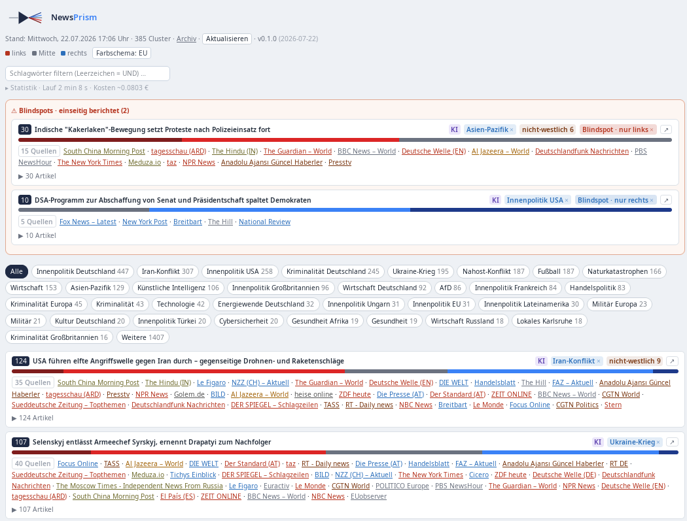
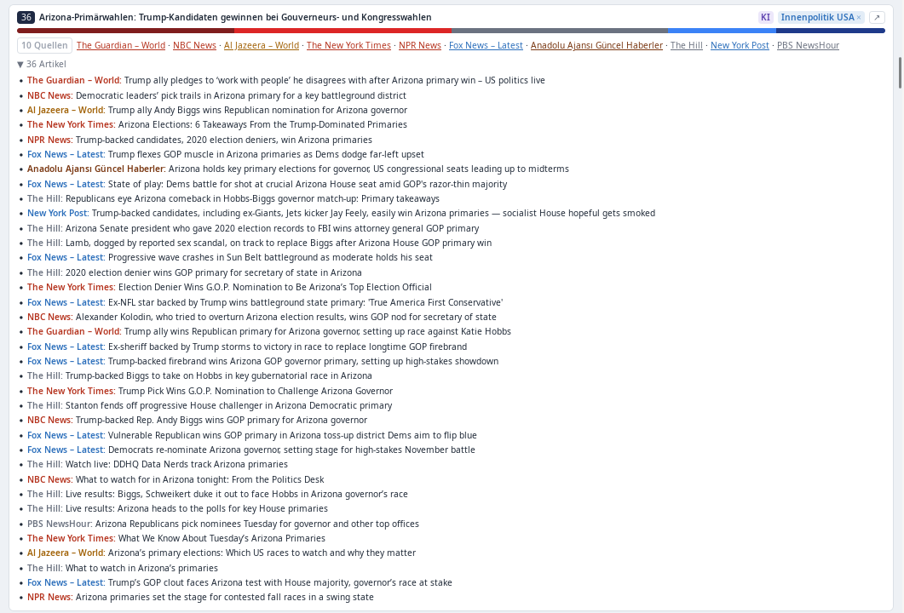

# 

*English · [Deutsch](README.de.md)*

A small, self-hosted news-aggregation and media-bias analysis pipeline for
your own RSS feed collection: it pulls articles from **FreshRSS or Miniflux**, assigns each
source a political lean and a fine-grained left–right position via a **bias
map** (or category rules), **clusters** the same story across multiple
outlets using embeddings, counts the **bias distribution** (over distinct
sources, not article count), and flags **blindspots** – stories covered by
only one side of the spectrum.

Optionally an LLM generates a neutral headline per cluster (cached, so
recurring stories aren't billed again).

Output: `digest.json`, an HTML dashboard (with collapsible per-article
detail) and two Atom feeds (main + blindspots only) to subscribe to in your
own reader.

Everything is toggled via `config.yaml` – no code changes needed.

## Screenshots

*Dashboard: blindspots at the top (stories covered by only one side), topic
filters, and cluster cards showing the bias distribution across distinct
sources. The UI is German by design – see [CONTRIBUTING](CONTRIBUTING.md).*

*An expanded cluster: the same story as reported by 10 outlets, each headline
coloured by the source's political lean (EU convention: left = red, right = blue).*

## Directory layout

The repository is the project itself (flat, build context "."). Only
templates (`*.example`) are versioned; the production files are created from
them via `cp` and are listed in `.gitignore` (they contain real hostnames,
source names, keys).

    Dockerfile
    newsprism.py
    requirements.txt
    docker-compose.example.yml     <- copy to docker-compose.yml
    config.example.yaml            <- copy to config/config.yaml
    bias_map.example.json          <- copy to config/bias_map.json
    entity_stopwords.example.yaml  <- copy to config/entity_stopwords.yaml
    .env.example                   <- copy to .env

The production configs live in the (gitignored) `config/` directory, which is
mounted into the container as a directory – so changes to
config.yaml/bias_map.json/entity_stopwords.yaml take effect at runtime
without a restart.

## Setup

1. **Clone the project**, then copy the templates:

       cp docker-compose.example.yml docker-compose.yml
       mkdir -p config
       cp config.example.yaml          config/config.yaml
       cp bias_map.example.json        config/bias_map.json
       cp entity_stopwords.example.yaml config/entity_stopwords.yaml
       cp .env.example .env

   Adapt the production `docker-compose.yml` to the local setup (hostname,
   network, reverse proxy, whether an existing nginx/web-server volume is
   shared).

2. **Adjust the config** (`config.yaml`), at minimum:
   - `reader.base_url` – internal recommendation: `http://freshrss/api/greader.php`
     (FreshRSS must be on the same Docker network).
   - `reader.username` / `password` – for FreshRSS use the **API password**
     from *Profile → API management* (not the login password); enable API
     access in the FreshRSS settings.
   - `lean.rules` / `lean.bias_map_path` – adapt to the local feed categories
     and the desired media classification (`bias_map.json` is only a starting
     point – the classification is subjective and should be adjusted to one's
     own assessment).
   - `output.*` – set the URLs to the local domain/IP.

3. **API keys** (only the ones used) in `.env`:

       ANTHROPIC_API_KEY=sk-ant-...
       COHERE_API_KEY=...

   Important: use `env_file: [.env]` at service level, not `environment:`
   interpolation – otherwise the key can be overwritten by an empty shell
   variable.

4. **Start**

       docker compose up -d --build
       docker compose run --rm -e RUN_ONCE=1 newsprism   # one-off test run

   The container runs as a non-root user (UID/GID 1000:1000 by default, see
   Dockerfile/docker-compose.yml). If the host user for the Docker volumes
   has a different UID/GID, set it at build time:

       docker compose build --build-arg UID=$(id -u) --build-arg GID=$(id -g) newsprism

   or change the `args:` values directly in `docker-compose.yml`.

5. **Output** lands in the configured output directory (default: a `/prisma`
   subfolder in the mounted web-server volume):
   - Dashboard:        `.../prisma/index.html`
   - Main feed:        `.../prisma/feed.xml`
   - Blindspot feed:   `.../prisma/feed-blindspots.xml`

6. **Subscribe in FreshRSS/Miniflux** – put both feeds in a dedicated
   category, e.g. "Prisma", and add that category to
   `reader.exclude_categories` (otherwise newsprism reads its own output as
   input – a feedback loop).

7. **Force an immediate run** (without a restart, e.g. after editing
   `bias_map.json` or for testing): send `SIGUSR1` to the running container –
   it interrupts the sleep cycle and starts a run immediately, after which
   the normal schedule resumes.

       docker kill -s SIGUSR1 newsprism

8. **Optional: "Refresh" button in the dashboard** – with
   `refresh_server.enabled: true` newsprism starts a small HTTP listener
   (`POST /refresh`) that triggers a run (with a cooldown via
   `min_interval_minutes`). The listener has **no authentication of its own**
   – it MUST sit behind a reverse proxy with auth. Example labels for Traefik
   with BasicAuth are in `docker-compose.yml`; the password hash is generated
   with:

       htpasswd -nb user secret
       # put the output into the basicauth.users label,
       # escaping $ as $$ (Docker Compose interpolation).

   The listener port is not mapped externally, only used internally by the
   proxy. SIGUSR1 is not subject to the cooldown.

## The main switches (config.yaml)

| Block | What it toggles |
|-------|-------------------|
| `reader.type` | `greader` (FreshRSS & Miniflux) or `miniflux` (native) |
| `reader.exclude_categories` / `exclude_sources` / `exclude_title_patterns` | exclude feedback loop & noise |
| `clustering.method` | `embedding` (recommended) or `llm` |
| `clustering.embedding.provider` | `openai_compatible` (API/Ollama) or `fastembed` (local/CPU) |
| `clustering.embedding.cache_path` | embedding cache – only new articles are re-embedded |
| `clustering.threshold` | cluster more strictly (smaller) ↔ more loosely (larger) |
| `clustering.entity_weight` | optional second signal: proper-noun overlap (0 = off) |
| `lean.bias_map_path` / `bias_map` | fine source→score mapping (−2…+2), takes precedence over category |
| `lean.source_overrides` | coarse lean assignment for individual sources |
| `blindspot.min_articles` / `min_sources` | thresholds for blindspot detection (over distinct sources) |
| `llm.enabled` / `provider` / `model` | story headlines on/off; `anthropic` / `openai_compatible` / `none` |
| `llm.max_clusters` | cost/call brake for the summaries |
| `llm.cache_path` | summary cache (incl. negative hits) |
| `hotspots.enabled` | group clusters into top-level topics in the dashboard (1 LLM call/run, display only) |
| `refresh_server.enabled` | HTTP listener + "Refresh" button (behind reverse-proxy auth) |
| `output.archive` | timestamped HTML snapshots under `archiv/` |
| `schedule.interval_hours` | run cadence |
| `schedule.active_start` / `active_end` | daytime window (e.g. only 07:00–23:00), rest = quiet hours |
| `output.feed_guid` | `change` (recommended) / `daily` / `run` – how often a story reappears in the reader |

## Caching & cost

With the embedding and summary caches active, each run only reprocesses
**new** articles or stories – recurring content costs nothing extra,
regardless of the run cadence. Typical cost at several thousand articles/day:

- **Embeddings** (`text-embedding-3-small`/`-large`): cents/month
- **LLM summaries** (`claude-haiku-*`, `max_clusters: 40-80`): ~0.5-3 EUR/month

A fully free/offline setup is possible with
`clustering.embedding.provider: fastembed` and `llm.enabled: false` – on a
weak CPU (no AVX2) embeddings are still possible that way, but noticeably
slower and semantically weaker than API models.

## Fine-tuning

- `clustering.threshold` is the central dial: too many mini-clusters ->
  raise it; too many distinct topics in one cluster -> lower it. For large,
  long-running topics (e.g. major sporting events) both goals collide – a
  known trade-off without a perfect solution.
- Clustering uses title **and** teaser/description – noticeably more
  discriminating than the title alone.
- `clustering.entity_weight` (0 = off by default) is an optional second
  signal alongside the pure embedding distance: detected proper
  nouns/acronyms (people, places, parties, organizations) are compared
  between two articles via Jaccard overlap. If they share names the effective
  distance drops (encourages merging "same story, different
  source/wording"); if they share none it rises (prevents merging different
  stories in the same topic field that are only lexically similar). The
  proper-noun detection is a heuristic with a stopword list for generic
  German news nouns – not an NER model, so not perfect. When enabling it,
  recalibrate `threshold` slightly, since the effective distance shifts.
- `lean.bias_map` is deliberately a simple, editable JSON file – the values
  are assessments, not a claim to objectivity. Adapt them to the local source
  list and rating.
- The LLM prompt explicitly asks for neutral German newspaper headlines and,
  for heterogeneous clusters, allows collective headlines ("X: debate over A,
  B and C") instead of falsely presenting a single sub-topic as
  representative.

## Security

Article content (titles, teasers, links) comes from RSS feeds – ultimately
from third parties. newsprism handles this as follows:

- **Links**: only `http(s)://` URLs are emitted as `<a href=...>` (dashboard
  and Atom feeds). `javascript:`/`data:` URIs from manipulated feeds are
  neutralized to `#`.
- **Lengths**: title/source name/category are truncated on ingest
  (300/120/200 chars) so an overlong value can't blow up embedding/LLM cost
  or the layout.
- **HTML escaping**: all text originating from articles is escaped when
  writing HTML/Atom.
- **Prompt injection**: article titles/teasers become part of the LLM prompt
  (for cluster headlines). A malicious feed could try to push the LLM toward
  a misleading headline. The result is still emitted HTML-escaped (no
  code-execution risk), and `min_sources`/`min_cluster_size` limit a single
  source's influence on a cluster. Prompt injection cannot be fully ruled out
  with this design – the LLM has to be able to read the article content.
- **TLS**: `reader.verify_tls: false` disables certificate verification
  entirely – use only for trusted internal hosts (e.g. own CA).
- **Secrets**: API keys are read exclusively via environment variables
  (`.env` + `env_file:`), never logged or written to output files.
- **Container hardening**: runs as a non-root user (UID/GID 1000:1000 by
  default, adjustable via build args), root filesystem read-only (only `/tmp`
  writable via tmpfs, plus the mounted `/data` and `/cache` volumes),
  `no-new-privileges` and all Linux capabilities dropped (`cap_drop: ALL`) –
  the process needs none of them (plain HTTP requests + file access to the
  volumes).

## Contributing

Contributions are welcome. Please note the [DCO](DCO) sign-off requirement
(`git commit -s`) — see [CONTRIBUTING.md](CONTRIBUTING.md)
([Deutsch](CONTRIBUTING.de.md)).

## License

Licensed under the **GNU Affero General Public License v3.0** (AGPL-3.0) –
see [LICENSE](LICENSE). In short: free to use, study, modify and share, but
modifications must stay open under the same license – and that also applies
when the software is offered as a network service (anyone running a modified
version as a public instance must make its source available to its users).

No guarantee for the correctness of the bias classification or cluster
quality – this is a personal homelab tool, not a journalistic product.

## Author

Peter Eisenhauer – questions and feedback via
[GitHub issues](../../issues) or `github@peter-e.de`.
